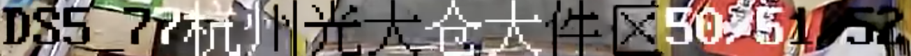
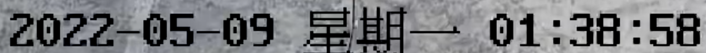

# Optical Character Recognition 

This repository offers a rapid inference API for demonstrating OCR tasks. 

## ONNX Model

The ONNX model, [PaddleOCR-512_onnx.onnx](./PaddleOCR-512_onnx.onnx), is derived from the official [ch_PP-OCRv3_rec_infer.tar](https://paddleocr.bj.bcebos.com/PP-OCRv3/chinese/ch_PP-OCRv3_rec_infer.tar). For further details, please consult the [paddle2onnx documentation](https://github.com/PaddlePaddle/PaddleOCR/blob/release/2.6/deploy/paddle2onnx/readme.md).

For comprehensive model specifications, kindly utilize the [Netron application](https://netron.app/).

## Data

Sample testing data is provided in the [./icdar_data](./icdar_data) directory for demonstration purposes. 

## Prerequisites

Please install the necessary packages using the following command:

`pip3 install -r requirements.txt`

## Directory Structure

- `characters.txt`: A file listing the characters that the OCR model can recognize.
- `icdar_data`: A directory containing sample images for OCR testing.
- `PaddleOCR-512_onnx.onnx`: The ONNX model file for OCR.
- `test_paddle.py`: A Python script to execute the OCR pipeline, encompassing both preprocessing and postprocessing stages.
- `res`: A directory for storing the results, including preprocessed images, input tensors, and OCR text outcomes.
- `eval_paddle_onnx.py`: A script designed for evaluating the accuracy of the OCR model.
- `test.txt`: A text file conatins evaluation inputs and its ground truth.
- `requirements.txt`: A text file conatins necessary packages.

## Usage

### Inference

Execute the following command for inference:

`python3 test_paddle.py --input_tensor_save --opt_tensor_save --preprocess_img_save`

Options:
- `--input_tensor_save`: Saves the pre-processed input tensors.
- `--opt_tensor_save`: Saves the output tensors generated by the OCR model.
- `--preprocess_img_save`: Saves the pre-processed images for inspection.

Inspect the `res` directory for the results post-execution, which include preprocessed images, input and output tensors, and the OCR text outcomes.

The OCR procedure can be tailored by adjusting the arguments provided to `test_paddle.py`. For instance, modifications can be made to the input image directory, model file, and output directory. For a comprehensive list of options, please refer to the argument parser section within the script.

### Evaluation

To evaluate the model, run:

`python3 ./eval_paddle_onnx.py`

This script calculates and displays the accuracy and normalized edit distance between the OCR model's predictions and the actual ground truth.

## Demonstration Results

For assessing the model's efficacy, various test datasets under different scenarios are available in the ./data folder, including Chinese, English, and date/time samples.

### Input Image

## Visualized Preprocessed Image

Additional examples of preprocessed images are accessible in ./res/pre_res/.

## Text Information

The output text files document the predictions and their associated probabilities:

Predictions for ./icdar_data/12.png:
- Predicted text: 2022-05-09 星期一 01:38:58
- Prediction probability: 0.8843010663986206

Predictions for ./icdar_data/15.png:
- Predicted text: DS577杭州光大仓大件区505152
- Prediction probability: 0.9113200306892395

Predictions for ./icdar_data/word_10.png:
- Predicted text: PAIN
- Prediction probability: 0.9839118719100952

# Additional Information

For interest in this project or any inquiries, please do not hesitate to contact me.
